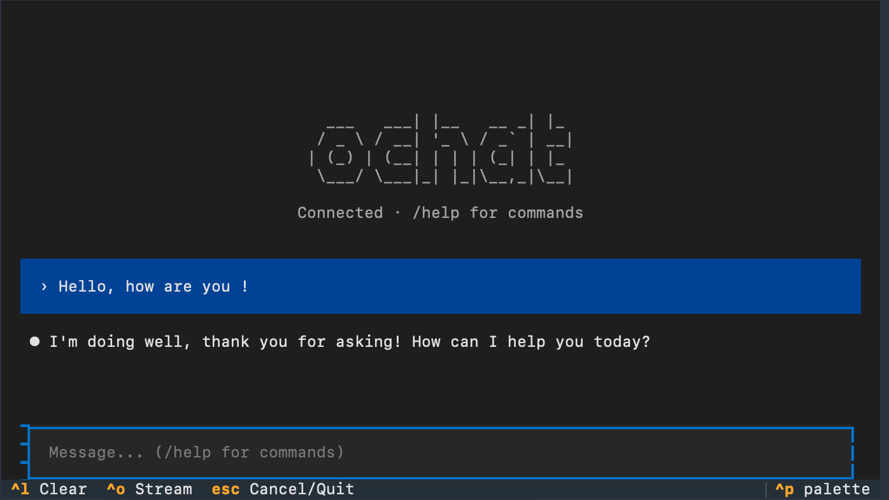

# ochat (formerly ollama-chat)

*Made with Claude to talk with non-Claude.*

Named "ollama-chat" because it started that way. Now a multi-backend TUI client (Ollama, OpenAI-compatible, llama.cpp) — just `ochat`.

A setup-and-forget multi-backend TUI chat client. One screen, no sub-menus, plenty of creature comforts.




## Why?

I wanted something like [Open WebUI](https://github.com/open-webui/open-webui) but in terminal. A chat interface without needing a full browser eating 8GB of RAM just to exist.

It started as a bare-bones wrapper, but grew into something I actually enjoy using daily — switchable personalities, auto-suggest, impersonate mode, context tracking, multiple config profiles. Still not Open WebUI, but not bare-bones either.

I also wanted a TUI as pleasant to use as [Claude Code](https://claude.com/claude-code) but for local Ollama models.

This project was entirely vibe-coded with Claude. It does exactly what I need.

## Features

- Clean TUI with streaming responses
- Switchable personalities (system prompts)
- Multiple config profiles (easily switch between setups)
- Project-specific prompts (auto-loads `agent.md`/`system.md` from current directory)
- Slash commands (`/help`, `/retry`, `/undo`, `/personality`, `/config`, `/impersonate`, etc.)
- Keyboard shortcuts (Ctrl+C cascade, Escape to cancel generation, Ctrl+O toggle streaming, Ctrl+T toggle reasoning, etc.)
- Auto-suggest: after each response, a short suggestion appears in the input (Tab to accept)
- Impersonate mode: LLM suggests what you'd say next (`/imp` long-form, `/imps` short)
- Context tracking with usage warnings and `/compact` to summarize conversation
- Generation stats (TTFT, tokens/s) in status bar and `/stats`
- Persistent configuration
- Pass-through for any Ollama model option (temperature, top_p, etc.) via config file
- Multi-backend support: Ollama (default), OpenAI-compatible (LM Studio, vLLM), llama.cpp server, or auto-detect

## Non-features

- It's just a client. No plan to have it start Ollama by itself or llama-cpp-python or anything
- Made for Ollama first, but supports OpenAI-compatible servers (LM Studio, vLLM) and llama.cpp server as first-class backends
- No conversation persistence yet (could use `agent.md` generation as lightweight conversation memory in the future)
- No multi-model conversations
- No model templates (chat templates are handled by Ollama/your server)
- No multiline input (TextArea doesn't support suggesters, and I prefer a single-line input with autocomplete over multiline without it — or making Claude reinvent the wheel and turning this codebase from "only Claude and God understand it" to "only God understands it")
- No RAG, no agents, no tools

## Installation

```bash
git clone https://github.com/baptisterajaut/ollama-chat
cd ollama-chat

# Optional: symlink to your bin
ln -s "$(pwd)/ochat.sh" ~/bin/ochat
```

The virtual environment and dependencies are created automatically on first run.

### Windows (untested)

```cmd
git clone https://github.com/baptisterajaut/ollama-chat
cd ollama-chat
ochat.bat
```

Windows support is experimental and untested.

## Usage

```bash
ochat                    # Start chatting (first run launches setup wizard)
ochat -C                 # Configure (host, model, personality)
ochat -m llama3.2        # Override model
ochat --new              # Create a new named config profile
ochat --use-config NAME  # Use a named config for this session
ochat --use-config NAME --as-default  # Switch to named config permanently
ochat -d                 # Enable debug logging
ochat --help             # Show options
```

### Keyboard shortcuts

| Key | Action |
|-----|--------|
| `Ctrl+C` | Cascade: clear input → cancel generation → double-press to quit |
| `Ctrl+D` | Quit |
| `Ctrl+L` | Clear chat |
| `Ctrl+O` | Toggle streaming |
| `Ctrl+T` | Toggle reasoning (thinking) |
| `Escape` | Cancel generation |
| `Tab` | Accept suggestion / autocomplete command |

### Slash commands

| Command | Action |
|---------|--------|
| `/help` | Show help |
| `/retry` | Regenerate last response |
| `/undo` | Remove last exchange, restore user message to input |
| `/copy` | Copy last response to clipboard |
| `/clear` | Clear chat history |
| `/personality` | List/switch personalities |
| `/config` | List/switch config profiles (restarts app) |
| `/impersonate` | Generate suggested user response (long-form) |
| `/imps` | Short impersonate (under 15 words) |
| `/suggest` | Toggle auto-suggest after responses |
| `/thinking` | Toggle reasoning at inference level |
| `/project` | Toggle project prompt merge |
| `/prompt` | Show current system prompt |
| `/sys <msg>` | Inject a system message (alias: `/system`) |
| `/model` | Show current model |
| `/stats` | Show generation statistics (TTFT, t/s, tokens) |
| `/compact` | Summarize conversation to free context |
| `/context` | Show context info |

## Configuration

Config lives in `~/.config/ochat/`:
- `config.conf` - Default settings (host, model, context size, etc.)
- `*.conf` - Named config profiles
- `personalities/` - System prompt templates (`.md` files)

### Multiple config profiles

You can create and switch between different configurations (different models, personalities, settings):

```bash
ochat --new                          # Create a new profile from scratch
ochat --use-config my-creative       # Use profile for this session only
ochat --use-config my-creative --as-default  # Make it the new default
```

Or switch in-app with `/config`. When switching with `--as-default`, your current config is backed up automatically.

Bundled personalities (copied on first run):
- `default` - Helpful, concise assistant
- `creative` - Brainstorming and unconventional ideas
- `storyteller` - Narrative and creative writing

### Advanced model options

You can add any Ollama model parameter in `config.conf`. These are passed directly to the API without validation:

```ini
[model_options]
temperature = 0.7
top_p = 0.9
top_k = 40
min_p = 0.05
repeat_penalty = 1.1
# Any other Ollama option works too
```

See [Ollama docs](https://docs.ollama.com/modelfile#valid-parameters-and-values) for available options. Not exposed in the setup wizard - edit the config file manually.

### Backend modes

Configure in `config.conf` under `[defaults] backend`: `ollama`, `openai`, `llama_cpp`, or `auto`.

**Ollama** (default): Full feature support — model listing, `num_ctx`, `model_options`, real token tracking.

**OpenAI-compatible**: Works with LM Studio, vLLM, text-generation-inference, and other servers exposing `/v1/chat/completions`. Uses the `openai` Python client. Limitations:
- No interactive model selection (model listing is used for connection testing only — you must configure the model name manually)
- `num_ctx` and `model_options` are ignored (server-side settings apply)
- Context usage tracking is disabled (percentages and warnings don't apply)
- Setup wizard won't work (configure `config.conf` manually)

**Llama.cpp**: Uses llama.cpp server's `/v1/chat/completions` and `/info` endpoints. Supports `num_ctx` via `/info` and real token tracking via `include_usage`.

**Auto**: Tries Ollama → llama.cpp → OpenAI in sequence.

**To use with LM Studio:**
```ini
[defaults]
backend = openai

[server]
host = http://localhost:1234

[defaults]
model = your-loaded-model-name
```

### Self-signed certificates (homelab)

For HTTPS hosts with self-signed certificates, the setup wizard will detect SSL errors and offer to disable verification. You can also set it manually in `config.conf`:

```ini
[server]
host = https://my-homelab:11434
verify_ssl = false
```

The greeting will show the backend type: `Connected (Ollama)`, `Connected (OpenAI)`, `Connected (llama.cpp)`, or `Connected (auto)`.

## Debugging

Logging is disabled by default. Use `-d` to enable:

```bash
ochat -d
```

Log files are written to temp (auto-cleaned after 7 days):
- **Unix/Mac**: `/tmp/ochat-YYYYMMDD-HHMMSS.log`
- **Windows**: `%TEMP%\ochat-YYYYMMDD-HHMMSS.log`

## Code quality

Average cyclomatic complexity: **A (3.3)** — no D or F.

<details>
<summary>Functions rated C (radon cc)</summary>

| Function | File | CC | Grade |
|----------|------|----|-------|
| `run_setup` | config.py | 18 | C |
| `_handle_undo` | commands.py | 14 | C |
| `main` | app.py | 14 | C |
| `_consume_chunks` | generation.py | 13 | C |
| `_handle_config_command` | commands.py | 12 | C |
| `_handle_command` | commands.py | 12 | C |
| `switch_config_to_default` | config.py | 12 | C |
| `_handle_compact` | commands.py | 11 | C |
| `_status_text` | app.py | 11 | C |

</details>

## Performance notes

Textual is lovely for building TUIs but its default paths don't hold up under realistic LLM streaming workloads — long streamed Markdown plus a hidden Chain-of-Thought block exposes a few pathologies that had to be worked around to keep the UI responsive:

- **Streaming Markdown rebuilds**: the stock `Markdown` widget re-parses the entire buffer on every `append()`, blocking the event loop on long reasoning. Subclassed to run the parse in a thread pool (`StreamingMarkdown`), so chunks keep flowing while mistune chews.
- **`:hover` on large subtrees**: a plain `:hover` CSS rule on the reasoning block triggers a full stylesheet re-apply to every descendant on every mouse-move (thousands of `MarkdownBlock` widgets, deep selector matching). Replaced with inline-style toggles in `on_enter` / `on_leave` and manual descendant cache invalidation — zero cascade cost, uniform tint.
- **Fire-and-forget `AwaitComplete`**: `Markdown.update()` returns an `AwaitComplete` that schedules its task via `asyncio.gather()` inside `__init__`. Calling it without `await` leaves an orphan task; at shutdown or lock contention you get `CancelledError was never retrieved` and can hang. Every call site now awaits.
- **Full-replace vs. incremental in non-stream mode**: forwarding the accumulated reasoning to `Message.update(reasoning=...)` on every chunk did an O(chunks × len) Markdown re-parse + remove-then-mount of every block. Reasoning is now rendered once at finalize, and the spinner body update is throttled to 10 Hz (`Markdown.update` is ~20-50ms of DOM churn per call).
- **Visual-style cache on descendants**: Textual caches per-widget composited colors in `_visual_style_cache`. Inline style changes on a parent don't invalidate children's caches, so hover tint would only apply to empty cells, not text cells. Fixed by walking descendants and calling `notify_style_update()` on hover enter/leave.

Net effect: reasoning streams with reasoning collapsed stay indistinguishable from plain text, hover-on-reasoning no longer freezes the UI for minutes, and non-stream generations render in real time instead of catching up several seconds after completion.

## Alternatives

If you want a more full-featured Ollama TUI, check out [parllama](https://github.com/paulrobello/parllama) and [oterm](https://github.com/ggozad/oterm). Both are capable and well-maintained. Their busier interfaces weren't to my taste — this project exists because I wanted a clean, single-screen interface with no panels or sidebars to manage.

## License

Public domain. You can't copyright AI-generated code anyway.

---

## "Vibe coding is awful, LLMs steal real code, you should've coded it yourself"

*Frankly my dear, I don't give a damn.*
